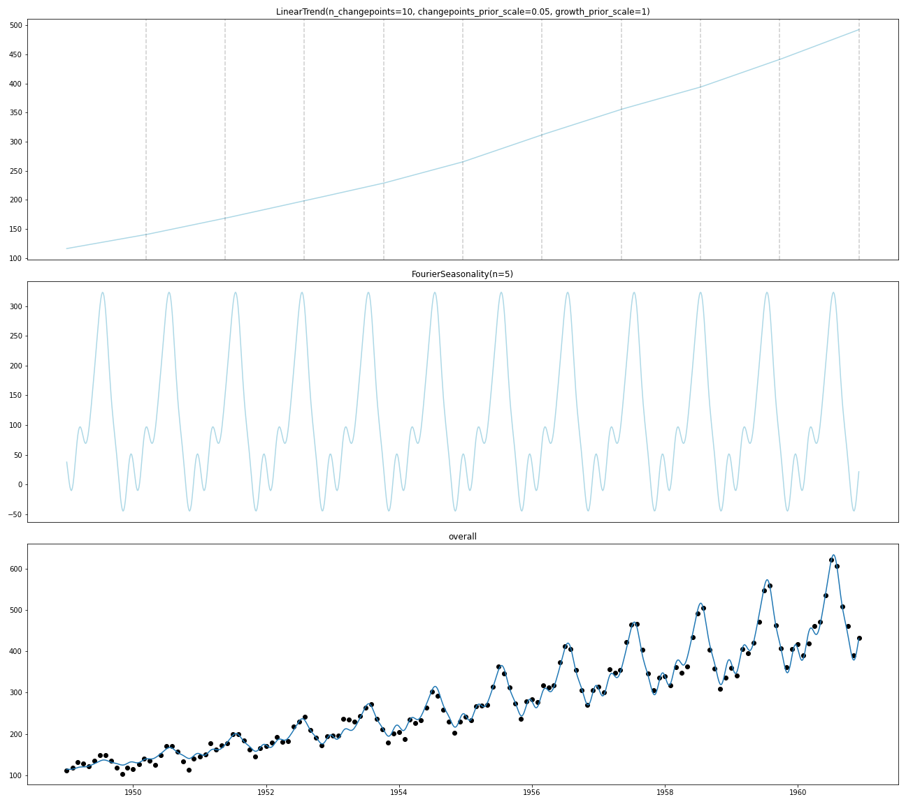

# Seers

> seers - (Noun) plural form of seer - A person who foretells future events by or as if by supernatural means

Seers is an hierarchical Bayesian Structural Time Series model based on [Facebooks Prophet](https://facebook.github.io/prophet/), written in PyMC3.

The goal of the Seers project is to provide an easily extensible alternative to Prophet for timeseries modelling when
multiple time series are expected to share parts of their parameters.
 
 
## Usage


### Multiplicative seasonality
```python
from seers import utils, LinearTrend, TimeSeriesModel, FourierSeasonality
import pandas as pd

passengers = pd.read_csv('AirPassengers.csv').reset_index().assign(
    t=lambda d: d['index'],
    value=lambda d: d['#Passengers']
)

model = LinearTrend(n_changepoints=10) * FourierSeasonality(n=5, periodicity=12/143)
model.fit(passengers[['t']], passengers['value'], tune=2000)

model.plot_components()
```

    Auto-assigning NUTS sampler...
    Initializing NUTS using jitter+adapt_diag...
    Multiprocess sampling (4 chains in 4 jobs)
    NUTS: [sigma, beta, m, delta, k]
    Sampling 4 chains, 0 divergences: 100%|██████████| 10000/10000 [00:57<00:00, 173.30draws/s]





```python

```

